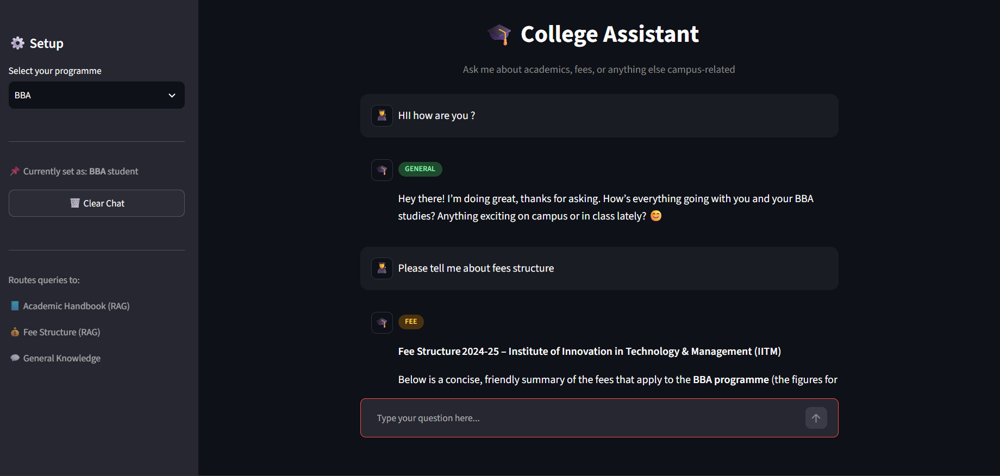
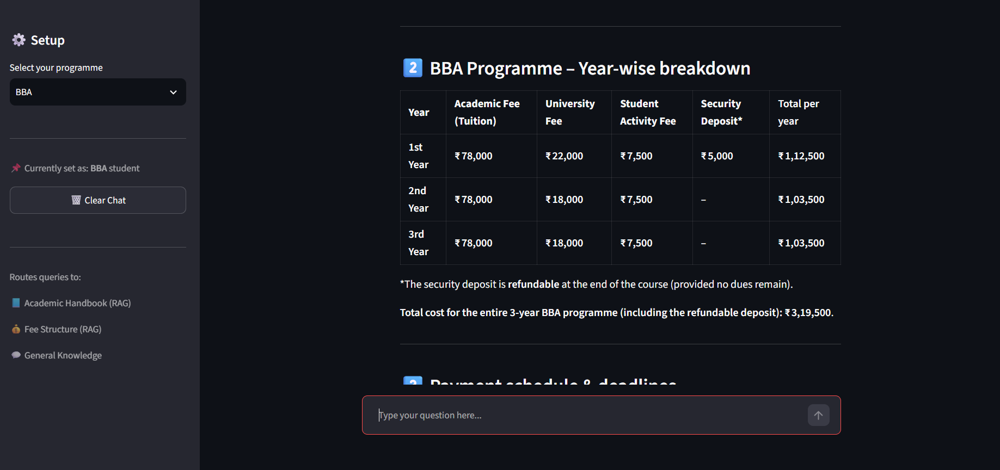

# 🎓 College Assistant

An AI-powered **College Assistant** built with **Streamlit, LangGraph, LangChain, Groq LLM, Hugging Face Embeddings, FAISS, and RAG**.

The application helps students get answers about **academic rules, fee-related information, and general college-related queries**. It uses different RAG paths depending on the type of question and retrieves information from the provided academic handbook and fee structure documents.

---

## ✨ Features

- 🎓 Student programme selection
  - BCA
  - BBA
  - B.Com (H)
- 📘 Academic information retrieval using RAG
- 💰 Fee-related information retrieval using RAG
- 💬 General question answering using an LLM
- 🧠 Automatic query classification
- 🔀 Conditional routing using LangGraph
- 📄 PDF-based knowledge retrieval
- 🔎 FAISS vector similarity search
- 🤗 Hugging Face sentence-transformer embeddings
- 💻 Interactive Streamlit chat interface
- 🗑️ Clear chat functionality
- 🏷️ Query-type indicators for Academic, Fee, and General queries

---

## 🧠 How It Works

The application uses a conditional RAG workflow built with LangGraph.

```text
                         User Query
                              │
                              ▼
                     ┌─────────────────┐
                     │ Query Classifier│
                     └────────┬────────┘
                              │
              ┌───────────────┼───────────────┐
              ▼               ▼               ▼
          Academic           Fee            General
              │               │               │
              ▼               ▼               │
      Academic Handbook   Fee Structure        │
            RAG               RAG               │
              │               │               │
              └───────────────┼───────────────┘
                              ▼
                       Response Generator
                              │
                              ▼
                         Final Answer
```

### Query Routing

The classifier identifies each user query as one of three categories:

- **Academic** → retrieves relevant information from the Academic Handbook.
- **Fee** → retrieves relevant information from the Fee Structure PDF.
- **General** → answers using the LLM without document retrieval.

The application uses separate retrievers for the academic handbook and fee structure, with retrieved chunks passed to the response-generation step.

---

## 🛠️ Tech Stack

| Technology | Purpose |
|---|---|
| Python | Core programming language |
| Streamlit | Web application and chat interface |
| LangGraph | Workflow orchestration and conditional routing |
| LangChain | LLM and RAG components |
| Groq | LLM inference |
| Hugging Face | Text embeddings |
| Sentence Transformers | `all-MiniLM-L6-v2` embeddings |
| FAISS | Vector similarity search |
| PyPDF | PDF document loading |
| python-dotenv | Environment variable management |

---

## 📂 Project Structure

```text
College-Assistant/
│
├── app.py
├── conditional_RAG_....py
├── academics_handbook.pdf
├── fee_structure.pdf
├── requirements.txt
├── README.md
├── .gitignore
└── .env                  # Not included in GitHub
```

> **Note:** The exact filename of the conditional RAG file can be updated in this section after uploading the project to GitHub.

---

## 📄 Knowledge Base

The application uses two PDF documents as its knowledge sources:

### 📘 Academic Handbook

Contains information related to:

- Programmes
- Attendance
- Examinations
- Evaluation
- Grading
- Promotion rules
- Reappear policy
- Summer training
- Project work
- Course structure

### 💰 Fee Structure

Contains information related to:

- Programme-wise fees
- Fee components
- Payment schedules
- Late payment charges
- Other fees
- Refund policies
- Scholarships
- Education loan assistance

---

## 🔍 RAG Pipeline

The application processes the PDF documents using the following workflow:

```text
PDF Documents
      │
      ▼
PyPDFLoader
      │
      ▼
Text Splitting
      │
      ▼
RecursiveCharacterTextSplitter
      │
      ▼
Hugging Face Embeddings
      │
      ▼
FAISS Vector Store
      │
      ▼
Similarity Retrieval
      │
      ▼
Relevant Context
      │
      ▼
LLM Response Generation
```

The documents are split into chunks before being converted into embeddings and stored in FAISS for retrieval.

---

## 🖥️ Screenshots

### 📸 Screenshot 1




### 📸 Screenshot 2




---

## 🌐 Live Demo

**Streamlit Cloud:**  

> Add your Streamlit Cloud live demo link here.

`PASTE_STREAMLIT_CLOUD_LINK_HERE`

---

## 🔗 GitHub Repository

**GitHub:**  

> Add your GitHub repository link here.

`PASTE_GITHUB_REPOSITORY_LINK_HERE`

---

## ⚙️ Installation

### 1. Clone the repository

```bash
git clone YOUR_GITHUB_REPOSITORY_URL
cd College-Assistant
```

### 2. Create a virtual environment

```bash
python -m venv .venv
```

### 3. Activate the virtual environment

**Windows:**

```bash
.venv\Scripts\activate
```

**macOS / Linux:**

```bash
source .venv/bin/activate
```

### 4. Install dependencies

```bash
pip install -r requirements.txt
```

---

## 🔐 Environment Variables

Create a `.env` file in the project root directory.

```env
GROQ_API_KEY=your_groq_api_key_here
```

> ⚠️ **Never upload your `.env` file or API keys to GitHub.**

The project uses `python-dotenv` to load environment variables.

---

## ▶️ Run the Application

Start the Streamlit application with:

```bash
streamlit run app.py
```

The application will open in your browser.

---

## 💡 Example Queries

Users can ask questions such as:

```text
What is the attendance requirement?

What are the promotion rules?

What is the fee structure for BCA?

What is the fee for BBA?

What are the scholarship options?

Tell me something about the college.
```

The application automatically determines whether the query requires academic retrieval, fee retrieval, or a general LLM response.

---

## 🚀 Future Improvements

- Add more academic programmes
- Add more institutional documents to the knowledge base
- Improve conversational memory
- Add document upload functionality
- Add source citations for retrieved answers
- Add authentication for students
- Improve deployment and monitoring
- Add more advanced multi-agent capabilities

---

## 👨‍💻 Author

**Sukendu Shit**

B.Tech — Computer Science and Engineering

Interested in:

- Artificial Intelligence
- Machine Learning
- Generative AI
- Large Language Models
- Retrieval-Augmented Generation (RAG)
- AI Agents
- Agentic AI
- Tool Calling
- Multi-Agent Systems

---

## 📜 License

This project is intended for educational and portfolio purposes.
